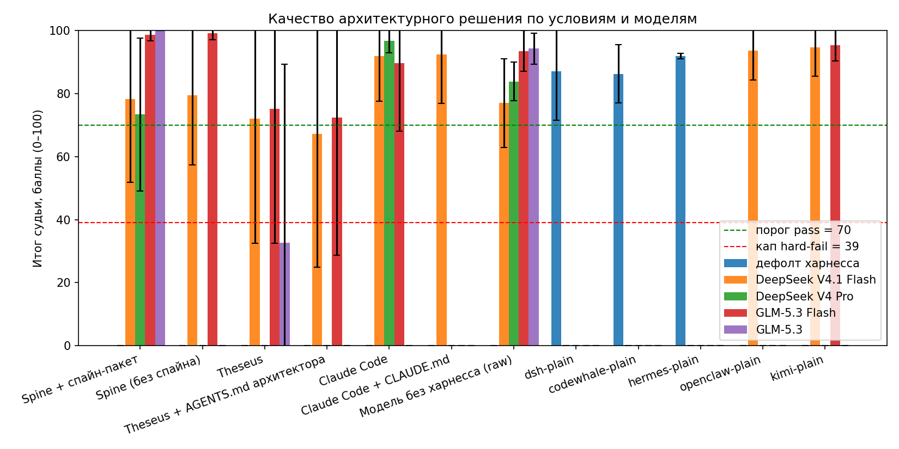
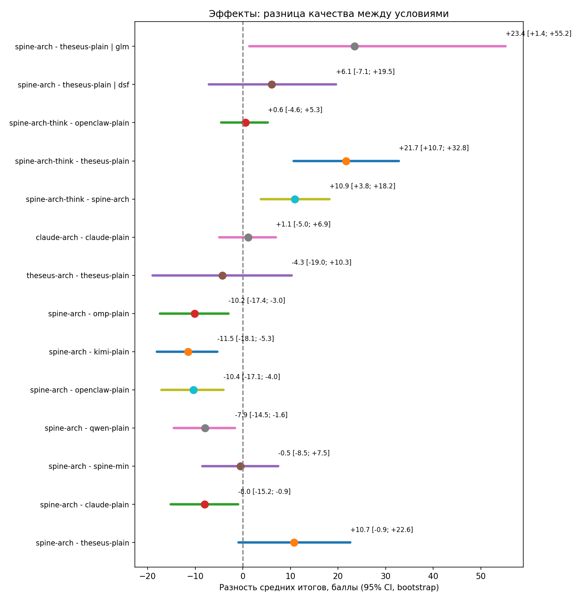
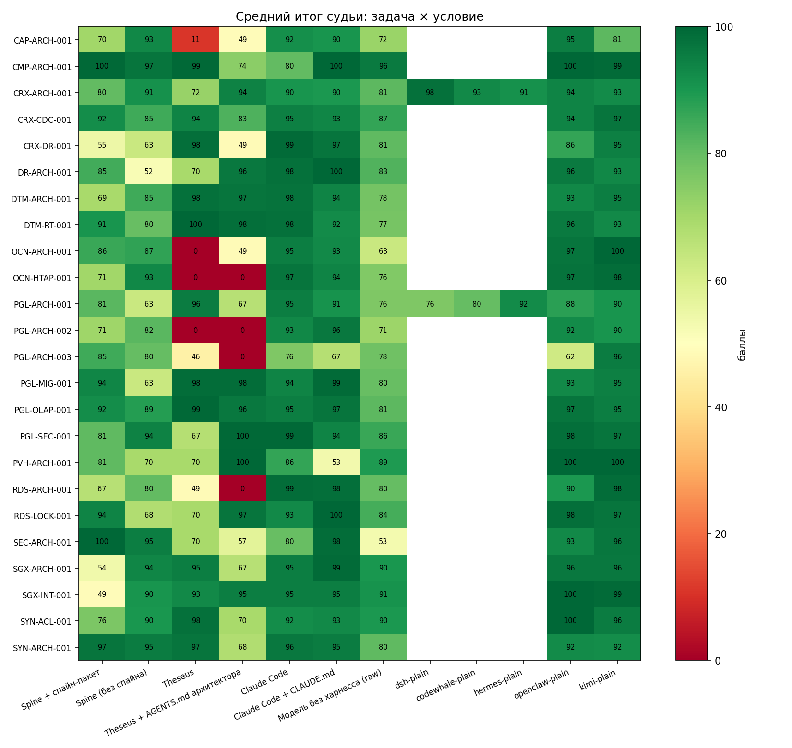
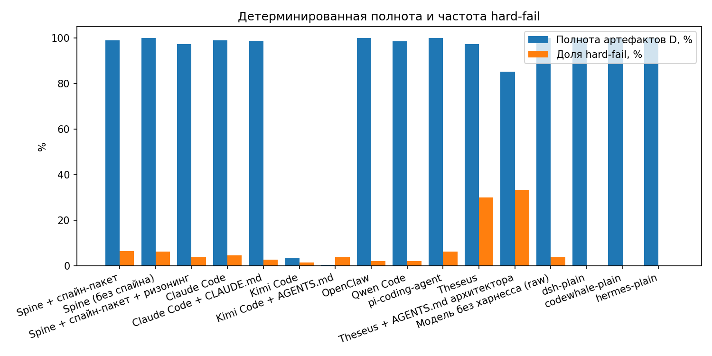
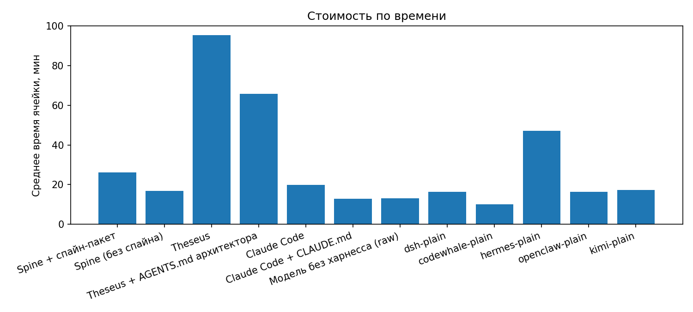

# Platform V Architecture Benchmark: Spine vs универсальные кодовые харнессы

> Профессиональный бенчмарх архитектурных задач по документации **Platform V
> (СберТех)**: измерение роли **харнесса и формата Spine** по сравнению с
> универсальными кодовыми харнессами (Claude Code, Kimi Code, Theseus,
> OpenClaw, Qwen Code, pi-coding-agent и др.).

---

> [!IMPORTANT]
> ## 🎯 Ключевые выводы для архитекторов
>
> Эталонная конфигурация Spine — **spine-arch-think** (харнесс + спайн-пакет + ризонинг модели, бюджет 64K). Все ключевые сравнения ниже — для неё.
>
> 1. **Spine с ризонингом — лучший или в паритете с лучшим на каждой модели:** 94.3 (DeepSeek V4.1 Flash), 94.5 (DeepSeek V4 Pro), 97.2 (GLM-5.3 Flash). Против Theseus — **+22.2 [+10.7; +34.3]** (значимо); против Claude Code — **паритет** (+2.4 [−3.7; +8.0]); против Kimi Code — **паритет** (−0.4 [−5.7; +4.5]).
> 2. **На GLM-5.3 Flash Spine значимо обходит Claude Code:** **+7.2 [+0.3; +18.5]** — единственное статистически значимое превосходство над универсалом-лидером.
> 3. **Отрыва от хороших универсалов нет.** Claude Code и Kimi Code с качественным `CONTEXT.md` закрывают те же задачи на 92–95 баллов без доменной специализации. Ценность Spine — не балл «из коробки», а контур вокруг него: гейты, трассируемость, handoff-пакеты (этот бенчмарк их не измеряет).
> 4. **Ризонинг — главный усилитель Spine:** +4.7 [−1.1; +10.9] к тому же Spine без ризонинга на V4.1 Flash и **+12.3 [+3.5; +20.5]** на V4 Pro (значимо). Вклад самого доменного формата (спайн-пакет) — слабый плюс +3–5 баллов поверх голого харнесса.
> 5. **Кастомизация универсалов под архитекторов не окупается** (H2 ✗, теперь на полных руках): claude-arch − claude-plain = +0.6 [−2.2; +4.2], kimi-arch − kimi-plain = −0.7 [−4.9; +3.3]. «Архитектурные» AGENTS.md для кодовых агентов эффекта не дают — не тратьте на них время.
> 6. **Агентный контур важнее выбора харнесса — но это зависит от модели** (H3 ✓): на DeepSeek голая модель даёт 77 против 90+ у любого харнесса (+14.9 [+10.0; +19.7] у Claude Code); на GLM-5.3 Flash голая модель почти не проигрывает (93.5, n=4 — осторожно). Эффект любого харнесса мерьте на своей целевой модели.
> 7. **Надёжность — главный риск агентных прогонов:** 30–33% ответов Theseus оборваны лимитом ходов; 18 «обрывов» Spine оказались дефектом извлечения, а не модели (D18); связка arch-be × glm-5.3-flash частично несовместима (D14). **Проверяйте пайплайн извлечения ответов прежде, чем судить модель.**

> [!TIP]
> **EN — Key takeaways for architects** (reference Spine configuration = **spine-arch-think**: harness + spine pack + model reasoning, 64K budget): (1) Spine with reasoning is best or tied for best on every model — 94.3 (DeepSeek V4.1 Flash), 94.5 (V4 Pro), 97.2 (GLM-5.3 Flash); vs Theseus **+22.2 [+10.7; +34.3]** (significant), vs Claude Code parity (+2.4 [−3.7; +8.0]), vs Kimi Code parity (−0.4 [−5.7; +4.5]); (2) on GLM-5.3 Flash Spine **significantly beats Claude Code: +7.2 [+0.3; +18.5]** — the only significant win over a leading universal; (3) no breakaway — good universals with a solid `CONTEXT.md` reach 92–95 without domain specialization; Spine's value is the surrounding loop (gates, traceability, handoff packs), which this benchmark does not measure; (4) reasoning is Spine's main amplifier: +4.7 [−1.1; +10.9] on V4.1 Flash, **+12.3 [+3.5; +20.5]** on V4 Pro; the domain format itself adds a modest +3–5 on top of the bare harness; (5) architect customization of coding harnesses does not pay off (H2 rejected on full arms: claude +0.6, kimi −0.7, CIs span zero); (6) the agentic loop matters more than harness choice on DeepSeek (raw model 77 vs 90+), but barely matters on GLM — everything is model-dependent, measure on your target model; (7) reliability is the main risk — turn-limit truncations and extraction defects; check your answer-extraction pipeline before judging a model.

---

## 🇷🇺 Русский

### Что это

Бенчмарк отвечает на вопрос, который встаёт перед каждым архитектором,
внедряющим агентные инструменты: **даёт ли специализированный харнесс
архитектора (Spine, banking edition) и его формат рабочих артефактов
(architecture-spine, CONSTRAINTS.yaml, fitness-гейты) измеримый выигрыш
в качестве архитектурных документов против универсальных кодовых агентов?**

24 архитектурные задачи построены строго по официальной документации
Platform V (Pangolin DB, Corax, Works::Architect Hub, DataMarts, SEI и др.):
целевая архитектура платёжного хаба, CDC-pipeline, комплаенс-маппинг
719‑П/683‑П/851‑П, защищённый контур, DR, ёмкостное планирование и т.д.
Каждая задача — это `TASK.md` (роль, deliverables D1–D10, ограничения),
`CONTEXT.md` (факты о продукте с метками `[DOC]`/`[BENCH]`/`[ASSUME]`,
ландшафт, INF/NFR/SEC-требования) и `RUBRICS.md` (взвешенные критерии 0–4
и правила hard-fail).

### Главный вопрос и гипотезы (пререгистрированы до прогонов)

- **H1**: Spine со спайн-пакетом (`spine-arch`) превосходит кодовые
  харнессы без кастомизации (`*-plain`).
- **H2**: кастомизация кодовых харнессов под архитекторов (arch-контекст)
  помогает, но не догоняет Spine.
- **H3**: эффект Spine зависит от модели.

### Ключевые результаты

**Сводка по условию × модели** (балл LLM-судьи 0–100, выше = лучше):

> **Обозначения условий:** `spine-arch` — харнесс Spine + спайн-пакет
> (architecture-spine + CONSTRAINTS.yaml, fitness-гейт) — «харнесс и
> формат»; `spine-min` — тот же харнесс Spine **без** спайн-пакета,
> минимальный системный промпт — изолирует вклад харнесса;
> `spine-arch-think` — `spine-arch` с включённым ризонингом модели
> (бюджет 64K); `<харнесс>-plain` — универсальный кодовый харнесс
> (Claude Code, Kimi Code, Theseus, OpenClaw, Qwen Code, omp)
> **в заводской конфигурации**, без архитектурной кастомизации;
> `<харнесс>-arch` — тот же харнесс с arch-кастомизацией
> (AGENTS.md/CLAUDE.md для архитекторов); `raw-llm` — голая модель
> (одиночный API-вызов, без агентного контура).

| Условие | DeepSeek V4.1 Flash | GLM-5.3 Flash | DeepSeek V4 Pro |
|---|---|---|---|
| **spine-arch** (Spine + формат) | 89.6 ± 14.6 (n=48) | 94.4 ± 17.7 (n=18) | 82.2 ± 16.0 (n=24) |
| **spine-min** (только харнесс) | 84.4 ± 15.5 (n=48) | **98.5 ± 3.3 (n=16)** | — |
| **spine-arch-think** (Spine + ризонинг) | 94.3 ± 14.7 (n=48) | 97.2 ± 3.7 (n=32) | 94.5 ± 12.3 (n=24) |
| claude-plain (Claude Code) | 91.9 ± 14.3 (n=48) | 89.6 ± 21.5 (n=16) | **96.8 ± 3.9 (n=24)** |
| kimi-plain (Kimi Code) | **94.7 ± 9.1 (n=48)** | 95.7 ± 4.8 (n=20) | — |
| claude-arch (Claude Code + кастом.) | 92.5 ± 15.7 (n=48) | 95.3 ± 4.6 (**n=6**) | 92.1 ± 6.8 (n=20) |
| kimi-arch (Kimi Code + кастом.) | 94.0 ± 12.3 (n=48) | 96.4 ± 3.9 (**n=11**) | 92.8 ± 13.5 (n=20) |
| openclaw-plain | 93.7 ± 9.3 (n=48) | — | — |
| omp-plain | 93.5 ± 14.5 (n=48) | — | — |
| qwen-plain | 91.3 ± 9.7 (n=48) | — | — |
| theseus-plain | 72.1 ± 39.6 (n=48) | 75.2 ± 42.7 (**n=9**) | — |
| theseus-arch | 67.3 ± 42.4 (n=48) | 72.4 ± 43.7 (**n=12**) | — |
| raw-llm (голая модель) | 77.0 ± 14.1 (n=48) | 93.5 ± 6.5 (**n=4**) | 83.9 ± 6.1 (n=24) |

**Жирным** — лидер колонки. **n** — число оценённых прогонов в ячейке:
полная ячейка это n=48 для dsf/glm (24 задачи × 2 повтора) и n=24 для dsp
(×1 повтор); ячейки с малым **n** (жирное n) — частичные руки (D14, D17),
сравнивать их с полными следует с осторожностью: выборка может быть
смещена в сторону «простых» или «сложных» задач.

**Эффекты** (парная разность средних по задачам, bootstrap 95% CI; эталон Spine —
**spine-arch-think**):

| Сравнение | Δ баллов | Что это значит |
|---|---|---|
| think − theseus-plain (dsf) | **+22.2 [+10.7; +34.3]** | **Spine значимо сильнее Theseus (H1 ✓)** |
| think − claude-plain, фабричный (dsf) | +2.4 [−3.7; +8.0] | премия над фабричным Claude Code (паритет) |
| think − claude-arch, arch-контекст (dsf) | +1.8 [−4.6; +8.1] | премия над Claude Code с кастомизацией (паритет) |
| think − kimi-plain (dsf) | −0.4 [−5.7; +4.5] | паритет с Kimi Code |
| think − kimi-arch (dsf) | +0.3 [−6.0; +6.0] | паритет с Kimi Code + кастомизация |
| think − spine-arch, без ризонинга (dsf) | +4.7 [−1.1; +10.9] | премия ризонинга на V4.1 Flash |
| think − spine-arch, без ризонинга (dsp) | **+12.3 [+3.5; +20.5]** | **премия ризонинга на V4 Pro — значима** |
| think − claude-plain (glm) | **+7.2 [+0.3; +18.5]** | **на GLM think значимо выше Claude Code** |
| think − kimi-plain (glm) | +0.7 [−1.4; +3.0] | на GLM паритет с Kimi Code |
| think − claude-plain (dsp) | −2.3 [−8.4; +1.6] | на V4 Pro паритет с Claude Code |
| spine-arch − claude-plain (dsf, без ризонинга) | −2.4 [−8.6; +3.6] | без ризонинга — паритет-минус |
| spine-arch − spine-min (dsf) | +5.2 [−1.0; +11.5] | вклад формата — слабый плюс поверх харнесса |
| claude-arch − claude-plain (dsf) | +0.6 [−2.2; +4.2] | H2 ✗: кастомизация Claude Code без эффекта |
| kimi-arch − kimi-plain (dsf) | −0.7 [−4.9; +3.3] | H2 ✗: кастомизация Kimi Code без эффекта |
| claude-plain − raw-llm (dsf) | **+14.9 [+10.0; +19.7]** | агентный контур даёт +15 над голой моделью |

### Честная интерпретация

0. **Важно: исправление D18 (обрывы).** Первая редакция результатов
   занижала Spine: 18 ячеек получили hard-fail из-за дефекта извлечения
   (arch-be писал полный документ в `work/answer.md`, а на stdout отдавал
   краткое подтверждение). После восстановления документов средний балл
   spine-arch на dsf вырос с 78.2 до 89.6, а выводы изменились:
1. **H1 подтверждена для Spine с ризонингом (эталонная конфигурация):**
   spine-arch-think значимо сильнее Theseus (**+22.2 [+10.7; +34.3]**) и
   идёт в **паритете с лучшими универсалами** — Claude Code
   (+2.4 [−3.7; +8.0]) и Kimi Code (−0.4 [−5.7; +4.5]). На GLM-5.3 Flash —
   **значимое превосходство над Claude Code** (+7.2 [+0.3; +18.5]).
   Без ризонинга (spine-arch) картина слабее: паритет-минус с Claude Code
   (−2.4) и отставание от Kimi Code (−5.1 [−9.9; −0.5]).
2. **Ризонинг — главный усилитель Spine:** премия think над spine-arch
   +4.7 на V4.1 Flash и **+12.3 [+3.5; +20.5]** на V4 Pro. Выключать
   ризонинг у Spine нельзя — без него харнесс теряет преимущество.
3. **Формат спайна — слабый плюс поверх харнесса** (spine-arch − spine-min
   = +5.2 [−1.0; +11.5]; в парном анализе — около +4), а не ноль, как в
   первой редакции (там вклад формата тонул в обрывах).
4. **Специализация даёт прирост относительно самого Spine, но не отрыв
   от хороших универсалов** — Kimi/Claude Code закрывают те же задачи
   на 92–95 баллов без доменного формата. Реальная ценность Spine —
   контур вокруг документа (гейты, трассировка, handoff), который этот
   бенчмарк не измеряет.
5. **Кастомизация универсалов под архитекторов (H2) эффекта не дала** —
   на полных руках: claude-arch − claude-plain = +0.6 [−2.2; +4.2],
   kimi-arch − kimi-plain = −0.7 [−4.9; +3.3].
6. Побочные находки: hard-fail rate у Theseus 30–33% (обрезка на лимите
   ходов); зафиксирована несовместимость arch-be × glm-5.3-flash в
   агентном режиме на части задач (D14).

### Методология

- **Матрица**: 1032 прогона в 19 условиях × 24 задачи × до 2 повторов ×
  5 моделей/конфигураций (DeepSeek V4.1 Flash / V4 Pro, GLM-5.3 Flash /
  5.3 + свип), завершено генераций 1017, **оценено судьёй 917**.
  kimi×glm прогонялся через OpenRouter (та же модель, D17).
- **Условия**: spine-arch, spine-min, spine-arch-think, theseus-plain/arch,
  claude-plain/arch, kimi-plain/arch, openclaw-plain, qwen-plain, omp-plain,
  raw-llm + свип dsh/codewhale/hermes (по 2 задачи). Эталонная
  конфигурация Spine — **spine-arch-think** (ризонинг включён).
- **Судья**: deepseek-v4-pro, анонимизированные ответы, JSON-вердикт по
  рубрикам, **верификация цитат** (доля неверифицированных evidence
  публикуется), hard-fail → потолок 39 баллов. Полная формула — в
  `runners/judge.py`.
- **Пререгистрация**: `PREREGISTRATION.md` (+ хэши задач
  `prereg_hashes_v2.txt`). Все отклонения задокументированы:
  `DEVIATIONS.md` (D1–D20).
- **Воспроизводство**: `runners/` — подготовка ячеек
  (`prepare_cells.py`), прогон (`run_matrix.py`), механические скореры
  (`mech_score.py`), судья (`judge.py`, пул — `judge_merge.py`), анализ
  (`analyze.py`), отчёт (`report_docx.py`). Полный отчёт с диаграммами:
  `report/otchet_platformv_arch_bench_20260913_1454.docx`.

### Ограничения

- Судья одиночный (deepseek-v4-pro) из семейства одного из решателей —
  смещение декларируется, но не измерено (пул судей отменён по стоимости).
- Сравнение dsf↔glm (H3) — на пересечении 8–16 задач; glm53-канал не закрыт.
- 2 ячейки выведены из-за хронических таймаутов (D14).
- Результаты — про режим «один документ на задачу»; они не оценивают
  многошаговую работу архитектора (гейты, трассировка, handoff) в проде.

### Состав репозитория

- `tasks/` — 24 задачи (TASK/CONTEXT/RUBRICS);
- `spine/`, `customization/` — спайн-пакеты и arch-кастомизация;
- `runners/` — весь код прогона, судейства и анализа (Python, stdlib);
- `results/` — `results.jsonl` (все 1032 записи, 917 с вердиктом судьи)
  и `summary.json`;
- `report/` — финальный docx + диаграммы PNG;
- `PREREGISTRATION.md`, `DEVIATIONS.md` — пререгистрация и D1–D20.

Источник истины и развитие бенчмарка — монорепозиторий Spine
(каталог `benchmarks/platformv-arch-bench/`).

---

## 🇬🇧 English

### What this is

A professional benchmark measuring whether a **specialized solution-architect
harness (Spine, banking edition)** and its working-artifact format
(architecture-spine, CONSTRAINTS.yaml, fitness gates) deliver a measurable
quality gain on architecture documents versus **general-purpose coding
harnesses** (Claude Code, Kimi Code, Theseus, OpenClaw, Qwen Code,
pi-coding-agent), on 24 architecture tasks built from the official
**Platform V (SberTech)** documentation.

**1032 runs (917 judged) · 24 tasks · 19 conditions · 5 model configurations · evidence-verified LLM judge · preregistered hypotheses**
>
> Status: 2026-09-14 snapshot — kimi-arch arm completed (n=48 on dsf);
> reference Spine configuration is **spine-arch-think** (reasoning on);
> claude-arch×glm and the 16-task GLM extension remain partial (D17).

### Headline results

> **Condition glossary:** `spine-arch` — Spine harness + spine pack
> (architecture-spine + CONSTRAINTS.yaml, fitness gate), i.e. "harness and
> format"; `spine-min` — same Spine harness **without** the spine pack
> (isolates the harness contribution); `spine-arch-think` — `spine-arch`
> with model reasoning enabled (64K budget); `<harness>-plain` — a
> general-purpose coding harness in its **stock configuration**, no
> architect customization; `<harness>-arch` — same harness with architect
> customization; `raw-llm` — bare model (single API call).
>
- **Important: D18 truncation fix.** The first data edition understated
  Spine: 18 cells hard-failed due to an extraction defect (arch-be wrote
  the full document to `work/answer.md` but printed only a short
  confirmation to stdout). After restoring the documents, spine-arch on
  dsf rose from 78.2 to 89.6 and the conclusions changed:
- **H1 confirmed for Spine with reasoning (reference configuration):**
  spine-arch-think beats Theseus significantly (**+22.2 [+10.7; +34.3]**)
  and is **at parity with the best universal harnesses** — Claude Code
  (+2.4 [−3.7; +8.0]) and Kimi Code (−0.4 [−5.7; +4.5]). On GLM-5.3
  Flash it **significantly beats Claude Code (+7.2 [+0.3; +18.5])**.
- **Reasoning is Spine's main amplifier:** think vs spine-arch is +4.7
  [−1.1; +10.9] on V4.1 Flash and **+12.3 [+3.5; +20.5]** on V4 Pro.
- **The spine format is a small plus on top of the harness**
  (spine-arch − spine-min = +5.2 [−1.0; +11.5], ~+4 in the task-paired
  view), not zero as in the first edition.
- **Specialization lifts Spine over itself but does not break away from
  good universal harnesses** — Kimi/Claude Code score 92–95 without the
  domain format. Spine's real value is the surrounding loop (gates,
  traceability, handoff packs), which this benchmark does not measure.
- **Customization of coding harnesses for architects (H2) showed no
  effect** on full arms: claude-arch − claude-plain = +0.6 [−2.2; +4.2],
  kimi-arch − kimi-plain = −0.7 [−4.9; +3.3].
- Side findings: Theseus hard-fail rate 30–33% (turn-limit truncation);
  an arch-be × glm-5.3-flash agentic-mode incompatibility on some tasks.

### Methodology

1032 runs (1017 completed, 917 judged) across 19 conditions × 24
tasks × 5 model configurations; kimi×glm ran via OpenRouter (same model,
D17).
Each task ships `TASK.md` (role, D1–D10 deliverables), `CONTEXT.md`
(doc-labeled product facts, INF/NFR/SEC requirements) and `RUBRICS.md`
(weighted 0–4 criteria, hard-fail rules). Judge: deepseek-v4-pro over
anonymized answers, JSON verdicts, **evidence-quote verification**,
hard-fail caps the score at 39. Hypotheses preregistered
(`PREREGISTRATION.md` + task hashes); all deviations documented
(`DEVIATIONS.md`, D1–D20). Full pipeline in `runners/` (stdlib-only
Python); per-cell data in `results/`; final report with diagrams in
`report/`.

### Limitations

Single-family judge (deepseek-v4-pro) — declared, not measured
(judge pool cancelled for cost); dsf↔glm comparison on an 8–16 task
intersection; 2 cells dropped (chronic timeouts, D14). The benchmark
evaluates single-document architecture work, not the full gated,
traceable, handoff-driven architect workflow.

### Repository layout

`tasks/` — 24 benchmark tasks · `spine/`, `customization/` — spine packs
and arch customization · `runners/` — generation, judging, analysis,
report code · `results/` — `results.jsonl` + `summary.json` ·
`report/` — final docx + PNG diagrams · `PREREGISTRATION.md`,
`DEVIATIONS.md`.

Canonical source: the Spine monorepo (`benchmarks/platformv-arch-bench/`).

---

## License

MIT (benchmark code and materials). Platform V product names and
documentation excerpts belong to SberTech and are used for evaluation
purposes only.
